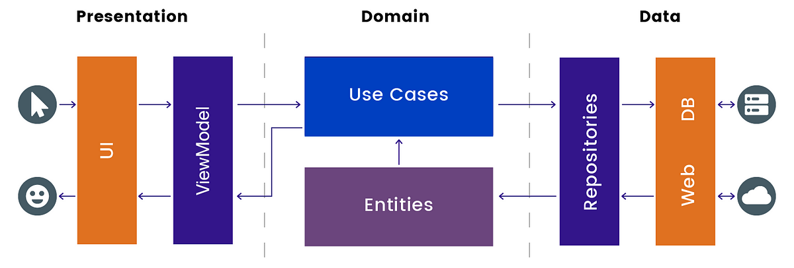

# Arquitectura CLEAN

La arquitectura **CLEAN** es un enfoque estructurado y modular para diseñar aplicaciones, que fomenta la separación de responsabilidades y hace que el código sea más mantenible, testeable y escalable. Al aplicarla en **Jetpack Compose**, se adapta el patrón a las particularidades del framework, teniendo en cuenta que Jetpack Compose es declarativo.

La arquitectura CLEAN fue propuesta por **Robert C. Martin (Uncle Bob)**. Se basa en principios como:

* **Independencia de frameworks:** El código no depende de herramientas específicas.
* **Testabilidad:** Las unidades de lógica de negocio pueden ser testeadas fácilmente.
* **Independencia de UI:** La interfaz de usuario puede cambiarse sin afectar la lógica de negocio.
* **Separación de responsabilidades:** Cada capa tiene una única responsabilidad.

Se divide en tres capas principales:

1. **Domain Layer (Dominio)**
2. **Data Layer (Datos)**
3. **Presentation Layer (Presentación)**

<figure><figcaption><p>Arquitectura CLEAN</p></figcaption></figure>

## **Domain Layer**

La capa más central y abstracta. Aquí se define la lógica de negocio pura e independiente.

#### **Responsabilidades**

* Contiene las entidades del dominio.
* Define casos de uso (Use Cases o Interactors).

#### **Componentes clave**

* **Entidades:** Representan los objetos principales del dominio.
* **Casos de uso:** Implementan la lógica de negocio específica. Por ejemplo, `GetUserProfileUseCase`.

```kotlin
data class UserProfile(val id: String, val name: String, val age: Int)

class GetUserProfileUseCase(private val userRepository: UserRepository) {
    suspend operator fun invoke(userId: String): UserProfile {
        return userRepository.getUserProfile(userId)
    }
}
```

## **Data Layer**

Gestiona la recuperación y almacenamiento de datos. Puede incluir fuentes remotas (APIs) o locales (bases de datos).

#### **Responsabilidades**

* Proveer datos al dominio.
* Implementar repositorios que cumplan contratos definidos en el dominio.

#### **Componentes clave**

* **Repositorios:** Interfaces definidas en la capa de dominio, implementadas aquí.
* **Data Sources:** Origen específico de datos (API, DB, etc.).

```kotlin
interface UserRepository {
    suspend fun getUserProfile(userId: String): UserProfile
}

class UserRepositoryImpl(
    private val api: UserApi,
    private val database: UserDatabase
) : UserRepository {
    override suspend fun getUserProfile(userId: String): UserProfile {
        val apiResponse = api.fetchUserProfile(userId)
        database.saveUserProfile(apiResponse)
        return apiResponse
    }
}
```

## **Presentation Layer**

Se encarga de mostrar datos al usuario e interactuar con él. En Compose, esta capa está compuesta por **ViewModels** y **composables**.

#### **Responsabilidades**

* Gestionar el estado de la UI.
* Comunicarse con la capa de dominio a través de casos de uso.
* Notificar cambios en el estado de la UI.

#### **Componentes clave**

* **ViewModel:** Coordina la lógica de la vista, mantiene el estado de la UI y ejecuta casos de uso.
* **UI Composable:** Renderiza la interfaz basada en el estado expuesto por el ViewModel.

#### **Ejemplo de ViewModel**

```kotlin
class UserProfileViewModel(
    private val getUserProfileUseCase: GetUserProfileUseCase
) : ViewModel() {
    private val _uiState = mutableStateOf<UserProfileUiState>(UserProfileUiState.Loading)
    val uiState: State<UserProfileUiState> = _uiState

    fun loadUserProfile(userId: String) {
        viewModelScope.launch {
            try {
                val userProfile = getUserProfileUseCase(userId)
                _uiState.value = UserProfileUiState.Success(userProfile)
            } catch (e: Exception) {
                _uiState.value = UserProfileUiState.Error(e.message ?: "Error loading profile")
            }
        }
    }
}

sealed class UserProfileUiState {
    object Loading : UserProfileUiState()
    data class Success(val userProfile: UserProfile) : UserProfileUiState()
    data class Error(val message: String) : UserProfileUiState()
}
```

#### **Ejemplo de UI Composable:**

```kotlin
@Composable
fun UserProfileScreen(viewModel: UserProfileViewModel) {
    val uiState by viewModel.uiState

    when (uiState) {
        is UserProfileUiState.Loading -> Text("Loading...")
        is UserProfileUiState.Success -> {
            val user = (uiState as UserProfileUiState.Success).userProfile
            Text("Welcome, ${user.name}!")
        }
        is UserProfileUiState.Error -> {
            val error = (uiState as UserProfileUiState.Error).message
            Text("Error: $error")
        }
    }
}
```

***

#### **3. Flujo de datos en CLEAN Architecture con Compose**

1. El **Composable** solicita datos al **ViewModel**.
2. El **ViewModel** ejecuta un caso de uso en la capa de dominio.
3. El caso de uso interactúa con el repositorio en la capa de datos.
4. El repositorio recupera datos desde una fuente de datos (API, base de datos, etc.).
5. Los datos fluyen hacia atrás hasta el Composable, donde se renderizan.

#### **4. Ventajas de CLEAN en Jetpack Compose**

* **Modularidad:** Puedes cambiar cualquier capa sin afectar las demás.
* **Testabilidad:** Los casos de uso y repositorios se pueden probar por separado.
* **Escalabilidad:** Facilita el crecimiento de la aplicación.
* **Claridad:** Cada capa tiene una responsabilidad bien definida.

## **Estructura de paquetes**

La estructura está organizada principalmente en base a las capas de la arquitectura CLEAN: **domain**, **data**, y **presentation**. Aquí tienes un desglose típico:

```
com.example.myapp
│
├── data
│   ├── model
│   ├── repository
│   ├── source
│   │   ├── local
│   │   └── remote
│   └── mapper
│
├── domain
│   ├── model
│   ├── repository
│   └── usecase
│
├── presentation
│   ├── ui
│   │   ├── components
│   │   ├── screens
│   │   │   ├── home
│   │   │   ├── profile
│   │   │   └── settings
│   ├── navigation
│   └── viewmodel
│
├── di
│
└── utils
```

**1. `data` (Capa de Datos)**

Contiene todo lo relacionado con la obtención y almacenamiento de datos.

* **`model`:** Clases de datos específicas para esta capa, como entidades de bases de datos o respuestas de API.
* **`repository`:** Implementaciones de los repositorios definidos en la capa de dominio.
* **`source`:** Fuentes de datos separadas:
  * **`local`:** Clases relacionadas con bases de datos (Room, SharedPreferences, etc.).
  * **`remote`:** Clases relacionadas con la red (retrofit, apis, etc.).
* **`mapper`:** Clases o funciones para transformar datos entre capas.

**2. `domain` (Capa de Dominio)**

Define la lógica de negocio pura e independiente de frameworks.

* **`model`:** Entidades de dominio (clases básicas que representan datos en la lógica de negocio).
* **`repository`:** Interfaces de los repositorios que implementará la capa de datos.
* **`usecase`:** Clases que implementan casos de uso específicos.

**3. `presentation` (Capa de Presentación)**

Gestiona la interacción con el usuario y contiene la lógica de presentación.

* **`ui`:** Elementos de la interfaz de usuario:
  * **`components`:** Elementos reutilizables de UI (botones, tarjetas, etc.).
  * **`screens`:** Pantallas completas organizadas por función (home, profile, etc.).
* **`viewmodel`:** Contiene los ViewModels que manejan el estado y la lógica de presentación.
* **`navigation`:** Gestión de la navegación (Graph de navegación, rutas, etc.).
