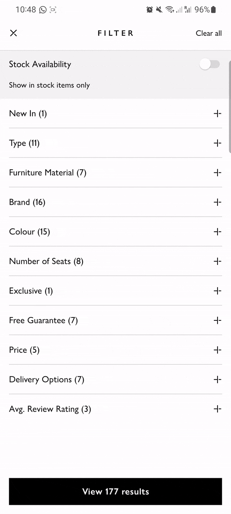

# Listados con LazyColumn y LazyRow

**LazyColumn** y **LazyRow** en Jetpack Compose son contenedores optimizados para listas grandes de elementos, evitando la creación de elementos fuera de la vista (carga perezosa o "lazy loading").

* **LazyColumn** organiza los elementos en una lista vertical.
* **LazyRow** organiza los elementos en una lista horizontal.

Estas listas son ideales cuando tienes muchos elementos, y quieres que solo se carguen cuando son visibles. Ambas listas tienen la misma estructura y funcionan de manera similar. Los componentes clave incluyen:

* `items()`: Para listar elementos únicos.
* `itemsIndexed()`: Para listar elementos con un índice (útil cuando necesitas la posición del elemento).
* `item { }`: Para añadir elementos individuales que no están en una lista.

### LazyColumn para una lista vertical

<figure><figcaption></figcaption></figure>

Con el componente LazyColumn podemos crear una lista vertical de componentes

```kotlin
@Composable
fun SimpleLazyColumn() {
    // Crea una lista de 100 elementos
    val itemsList = List(100) { "Item #$it" } 
    LazyColumn {
        items(itemsList) { item ->
            Text(text = item, modifier = Modifier.padding(16.dp))
        }
    }
}
```

Para que este código funcione son necesarios los siguientes import

```kotlin
import androidx.compose.foundation.lazy.LazyColumn
import androidx.compose.foundation.lazy.items
```

Explicación:

1. **itemsList** crea una lista de 100 elementos con el texto "Item #".
2. **LazyColumn** se utiliza para organizar estos elementos verticalmente.
3. La función `items(itemsList)` recorre cada elemento y lo coloca en la vista.

### LazyRow para una lista horizontal

La configuración de **LazyRow** es similar a la de **LazyColumn**, pero organiza los elementos horizontalmente.

```kotlin
kotlinCopy code@Composable
fun SimpleLazyRow() {
    val itemsList = List(10) { "Horizontal Item #$it" }
    LazyRow {
        items(itemsList) { item ->
            Text(text = item, modifier = Modifier.padding(16.dp))
        }
    }
}
```

#### Explicación:

1. **LazyRow** organiza los elementos horizontalmente.
2. La función `items(itemsList)` recorre cada elemento de la lista y los dispone en fila.

***

### 4. Ejemplo con índices usando itemsIndexed

Si necesitas acceder al índice de cada elemento, puedes usar **itemsIndexed**.

```kotlin
@Composable
fun LazyColumnWithIndices() {
    val itemsList = List(20) { "Item #$it" }
    LazyColumn {
        itemsIndexed(itemsList) { index, item ->
            Text(
                text = "Index $index: $item",
                modifier = Modifier.padding(16.dp)
            )
        }
    }
}
```

### Encabezados y pies de lista con item

Es posible agregar elementos que no sean parte de la lista (como encabezados y pies de página) utilizando la función `item`.

```kotlin
@Composable
fun LazyColumnWithHeaderAndFooter() {
    val itemsList = List(15) { "Item #$it" }
    LazyColumn {
        item {
            Text(text = "Encabezado", style = MaterialTheme.typography.titleMedium, modifier = Modifier.padding(16.dp))
        }
        items(itemsList) { item ->
            Text(text = item, modifier = Modifier.padding(16.dp))
        }
        item {
            Text(text = "Pie de página", style = MaterialTheme.typography.titleMedium, modifier = Modifier.padding(16.dp))
        }
    }
}
```

### Configurar el Espaciado entre Elementos con Modifier

Si necesitas añadir espacio entre los elementos, puedes hacerlo con `Arrangement` en `Modifier.padding()`.

```kotlin
@Composable
fun LazyColumnWithSpacing() {
    val itemsList = List(10) { "Item #$it" }
    LazyColumn(
        //añade espacio de 8dp entre cada elemento
        verticalArrangement = Arrangement.spacedBy(8.dp),
        // añade espacio alrededor de toda la lista.
        modifier = Modifier.padding(16.dp)
    ) {
        items(itemsList) { item ->
            Text(text = item, modifier = Modifier.fillMaxWidth())
        }
    }
}
```

## ViewModel de listados


Por ejemplo, podríamos crear una ventana para el ejemplo de la aplicación de tareas que muestre la lista de tareas que hay en el viewmodel

#### TasksScreen

Esta ventana muestra una lista de tareas usando un LazyColumn. Para gestionar la lista de tareas crearemos `TasksViewModel`


```kotlin
import androidx.lifecycle.ViewModel
import com.example.myandroidapp.domain.model.Task
import kotlinx.coroutines.flow.MutableStateFlow
import kotlinx.coroutines.flow.StateFlow

class TasksViewModel : ViewModel() {
    // Estado mutable que almacena el listado de tareas
    private val _tasks = MutableStateFlow<List<Task>>(
        listOf(
            Task(1, "Tarea 1", "Esta tarea hace cosas"),
            Task(2, "Tarea 2", "Esta tarea hace otras cosas"),
            Task(3, "Tarea 3", "Esta tarea hace no hace nada"),
            Task(4, "Tarea 4", "Bla bla bla"),
            Task(5, "Tarea 5", "La ultima tarea")
        )
    )
    // Version inmutable del estado anterior, es el estado que va a leer el UI
    val tasks: StateFlow<List<Task>> = _tasks

    // Elimina una tarea
    fun removeTask(id: Int) {
        // Quita la tarea con el id del parametro de la lista
        _tasks.value = _tasks.value.filter { it.id != id }
    }
}
```


Después usamos el ViewModel en la ventana TasksScreen


```kotlin
import TasksViewModel
import androidx.compose.foundation.layout.Column
import androidx.compose.foundation.layout.Row
import androidx.compose.foundation.layout.Spacer
import androidx.compose.foundation.layout.fillMaxWidth
import androidx.compose.foundation.layout.height
import androidx.compose.foundation.layout.padding
import androidx.compose.foundation.layout.width
import androidx.compose.foundation.lazy.LazyColumn
import androidx.compose.foundation.lazy.items
import androidx.compose.material.icons.Icons
import androidx.compose.material.icons.filled.Remove
import androidx.compose.material3.Button
import androidx.compose.material3.Card
import androidx.compose.material3.Checkbox
import androidx.compose.material3.Icon
import androidx.compose.material3.IconButton
import androidx.compose.material3.Scaffold
import androidx.compose.material3.Text
import androidx.compose.material3.TextField
import androidx.compose.runtime.Composable
import androidx.compose.runtime.collectAsState
import androidx.compose.runtime.getValue
import androidx.compose.runtime.key
import androidx.compose.runtime.mutableStateOf
import androidx.compose.runtime.remember
import androidx.compose.runtime.setValue
import androidx.compose.ui.Alignment
import androidx.compose.ui.Modifier
import androidx.compose.ui.unit.dp
import com.example.myandroidapp.domain.model.Task
import androidx.lifecycle.viewmodel.compose.viewModel
import androidx.compose.runtime.getValue

@Composable
fun TasksScreen(tasksViewModel: TasksViewModel = viewModel()) {
    val tasks by tasksViewModel.tasks.collectAsState()
    
    Scaffold { innerPadding ->
        Column(Modifier.padding(innerPadding)) {
            Text("Listado de tareas")
            Spacer(modifier = Modifier.height(16.dp))
            LazyColumn {
                items(tasks) { task ->
                    key(task) {
                        TaskCard(task = task, tasksViewModel = tasksViewModel)
                    }
                }
            }
        }
    }
}

@Composable
fun TaskCard(task: Task, tasksViewModel: TasksViewModel) {
    var expanded by remember { mutableStateOf(false) }
    Card(
        modifier = Modifier
            .fillMaxWidth(),
        onClick = {
            expanded = !expanded
        }
    ) {
        Column {
            if (!expanded) {
                Row(
                    verticalAlignment = Alignment.CenterVertically
                ) {
                    Icon(
                        imageVector = Icons.Default.ExpandMore,
                        contentDescription = "Expandir"
                    )
                    Text(task.title)
                }
            } else {
                Row(
                    verticalAlignment = Alignment.CenterVertically
                ) {
                    Icon(
                        imageVector = Icons.Default.ExpandLess,
                        contentDescription = "Contraer"
                    )
                    Text(task.title)
                }
                
                Spacer(modifier = Modifier.height(16.dp))
            
                Text(task.description)
                
                Spacer(modifier = Modifier.height(16.dp))
    
                IconButton(onClick = { tasksViewModel.removeTask(task.id) }) {
                    Icon(
                        imageVector = Icons.Default.Remove,
                        contentDescription = "Icono de eliminar"
                    )
                }   
            }
        }
    }
}
```


## Recomposiciones de listados y claves

El modificador `key` se utiliza para ayudar a Compose a identificar elementos específicos dentro de una lista o un conjunto de elementos que se recomponen frecuentemente. Al usar claves, le estás dando una **identidad única** a un elemento dentro de un grupo para que Compose sepa cómo gestionar de forma adecuada las recomposiciones.

Sin una clave, Compose puede no ser capaz de diferenciar correctamente entre instancias de composables, lo que puede llevar a errores o pérdida de estado.

**¿Por qué es importante usar claves?**

Las claves son útiles en situaciones donde los elementos de una lista o conjunto pueden cambiar de posición, agregarse o eliminarse, y deseas que Compose sepa qué elemento es cuál. De esta forma, el sistema puede preservar el estado correcto de los composables.

Por ejemplo, en listas dinámicas o con elementos interactivos, las claves aseguran que los elementos se identifiquen correctamente durante las recomposiciones, y no se pierda el estado específico de cada uno.

```kotlin
@Composable
fun ListaDeElementos(items: List<String>) {
    LazyColumn {
        items(items) { item ->
            key(item) {
                Text(text = item)
            }
        }
    }
}
```

**¿Qué pasa si no uso claves?**

Si no usas claves, puede haber problemas a la hora de identificar qué elementos corresponden a qué instancias previas. Esto puede llevar a situaciones donde Compose pierde el estado específico de un elemento, o donde un elemento hereda el estado de otro.

Por ejemplo, si no usas `key` en una lista y reordenas los elementos, los estados (como el texto en un campo editable) podrían quedar asociados a un elemento incorrecto.
