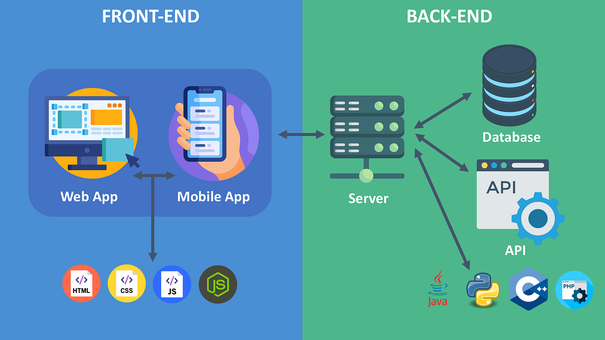
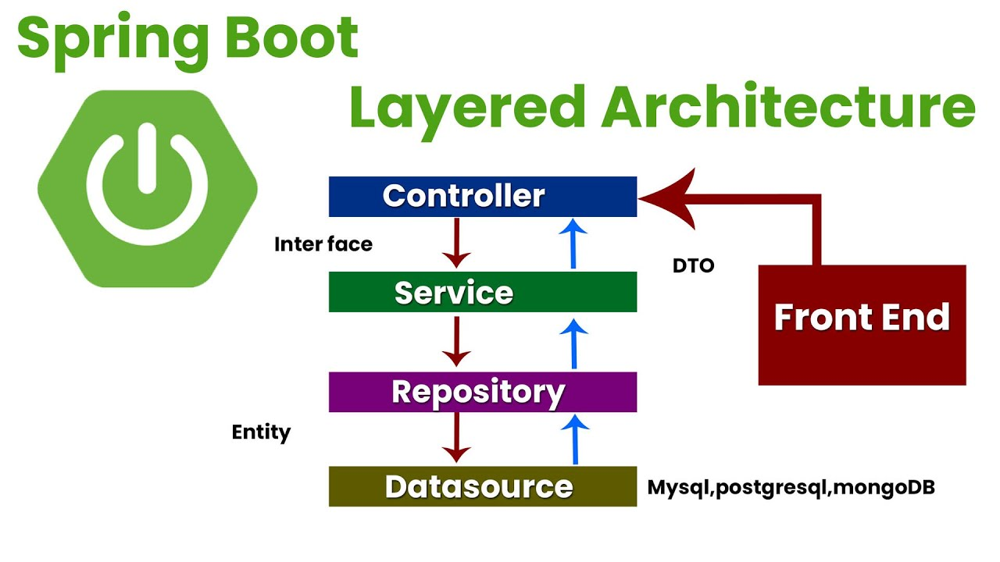
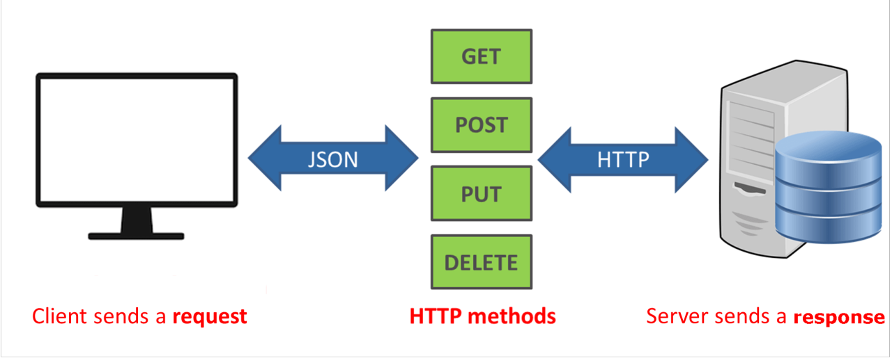
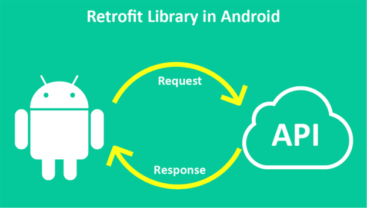

# Acceso a datos remotos con Retrofit

## **Arquitectura Frontend-Backend**&#x20;

La arquitectura **Frontend-Backend** define cómo una aplicación se organiza en dos componentes principales que trabajan de manera independiente pero conectados:

* **Frontend:** La interfaz de usuario, donde los usuarios interactúan con la aplicación.
* **Backend:** El sistema que gestiona la lógica del negocio, la persistencia de datos y la seguridad.

El protocolo REST (**Representational State Transfer**) actúa como el protocolo de comunicación entre ambos componentes, permitiendo el intercambio de información mediante solicitudes HTTP.

<figure><figcaption></figcaption></figure>

### **Frontend (Cliente)**

El **Frontend** es la parte visible y con la que interactúan los usuarios de una aplicación o sistema. Es lo que se ejecuta en el navegador web, dispositivos móviles u otro dispositivo que utilice el usuario. Su objetivo es proporcionar una experiencia visual e interactiva, permitiendo que los usuarios interactúen con la funcionalidad del sistema. El **Frontend** es la capa encargada de:

* Presentar los datos obtenidos del Backend al usuario.
* Capturar las interacciones del usuario.
* Enviar solicitudes HTTP al servidor Backend.

<figure><figcaption></figcaption></figure>

Se ejecutan en un dispositivo del usuario. Algunas de las tecnologías más comunes para desarrollar un Frontend son:

* **Web**: HTML, CSS, JavaScript (React, Vue.js, Angular)
* **Aplicaciones de escritorio:** Swing, JavaFx...
* **Aplicaciones móviles:** Jetpack Compose, Flutter, React Native

### **Backend (Servidor)**

El **Backend** es la parte del sistema que se ejecuta en el servidor. Es responsable de gestionar la lógica del negocio, las bases de datos y cualquier procesamiento necesario para que el sistema funcione correctamente. El Backend es esencialmente "el cerebro" que realiza operaciones y responde a las solicitudes del Frontend. El **Backend** es la capa encargada de:

* Procesar las solicitudes HTTP provenientes del Frontend.
* Implementar la lógica del negocio.
* Acceder a bases de datos para almacenar o consultar información.
* Aplicar seguridad (autenticación y autorización).

<figure><figcaption></figcaption></figure>

Se ejecuta en servidores físicos, en la nube o en servicios serverless. Algunas de las tecnologías más comunes son:

* **Lenguajes**: Node.js, Python, Java, Go
* **Frameworks**: Express, Django, Spring Boot
* **Bases de datos**: MySQL, PostgreSQL, MongoDB

## **Comunicación Frontend-Backend**

La comunicación entre el **Frontend** y el **Backend** a través de una **API REST (Representational State Transfer)** se realiza mediante el protocolo HTTP, que permite la transferencia de datos de manera estandarizada entre ambos componentes de una aplicación.

1.  **Solicitud del Frontend (HTTP Request)**\
    El Frontend envía una solicitud HTTP al Backend para consumir un recurso.

    ```vbnet
    GET /api/products HTTP/1.1
    Host: www.example.com
    ```
2. **Procesamiento en el Backend**\
   El servidor Backend recibe la solicitud, ejecuta la lógica de negocio necesaria y consulta la base de datos si es requerido.
3.  **Respuesta del Backend (HTTP Response)**\
    El servidor devuelve una respuesta HTTP, generalmente en formato JSON.

    ```json
    [
        { "id": 1, "name": "Laptop", "price": 1500 },
        { "id": 2, "name": "Mouse", "price": 20 }
    ]
    ```
4. **Renderización en el Frontend**\
   El Frontend recibe los datos y los muestra al usuario de manera interactiva.

### **Métodos HTTP más comunes en REST**

* **GET:** Solicita recursos (por ejemplo, `GET /api/products`).
* **POST:** Crea nuevos recursos (por ejemplo, `POST /api/products`).
* **PUT:** Actualiza un recurso existente (por ejemplo, `PUT /api/products/1`).
* **DELETE:** Elimina un recurso (por ejemplo, `DELETE /api/products/1`).

<figure><figcaption></figcaption></figure>

La comunicación entre el **Frontend** y el **Backend** suele realizarse mediante una **API REST**. Esta es una interfaz que define cómo dos sistemas pueden intercambiar información utilizando el protocolo HTTP (el mismo que se usa para navegar por Internet).

## Comunicación Backend-frontend con Retrofit

**Retrofit** es una librería desarrollada por **Square** que se utiliza en aplicaciones Android (y otras plataformas Java) para realizar solicitudes HTTP/RESTful de manera sencilla, estructurada y eficiente. Se utiliza principalmente para interactuar con APIs web y transformar los datos recibidos (JSON o XML) en objetos que tu aplicación pueda manejar directamente.

<figure><figcaption></figcaption></figure>

Esta librería nos permite:

1. **Consumo de APIs RESTful**: Retrofit facilita realizar solicitudes HTTP como `GET`, `POST`, `PUT`, `DELETE`, etc., para consumir datos desde un servidor.
2. **Transformación automática de datos**: Convierte automáticamente las respuestas en JSON (o XML) en objetos de Kotlin o Java utilizando convertidores como **Gson**, **Moshi**, o incluso un serializador propio.
3. **Simplificación del manejo de solicitudes HTTP**: Proporciona una interfaz clara para definir los endpoints y los parámetros, eliminando la complejidad de manejar manualmente conexiones HTTP con `HttpURLConnection` o `OkHttp`.
4. **Manejo de errores**: Facilita la captura y manejo de errores relacionados con la red o con las respuestas de la API, como códigos de estado HTTP incorrectos o fallos de red.
